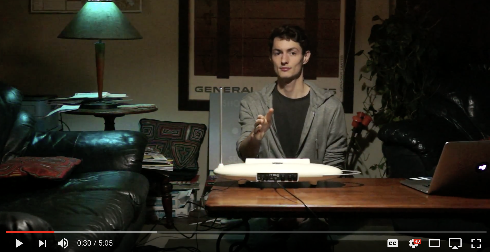

# Hue Theremin

[](https://www.youtube.com/watch?v=cf9S9SADu6g)

Using a theremin to control [Philip's Hue lights](https://www2.meethue.com/en-us)


# Usage

#### Hardware

- Hue lights + hub
- [Moog Theremini](https://www.moogmusic.com/node/92916)

Other types of equipment should work as well, although you may need to tweak the scripts.

#### Building

```bash 
$ cd hue-theremin
$ npm install
$ npm run compile
```

#### Running

1. Get the host name of your hue hub and setup a developer user account. (see [here](https://github.com/peter-murray/node-hue-api) for more details)

1. `$ node out/index.js --hueHost 192.168.1.x --hueUsername 'HUB_DEV_USERNAME' --light 4`

Command line options:

* `--hueHost` — Host of the hue hub to control
* `--hueUsername` — Dev user name for the hub
* `--light` — Id of light to control. Can pass in multiple lights as `--light 1,4`. (Warning, multiple lights don't work great currently)
* `--pitchChannel` — Midi channel for the theremin's pitch. Defaults to 176
* `--volumeChannel` — Midi channel of the theremin's volume. Defaults to 177